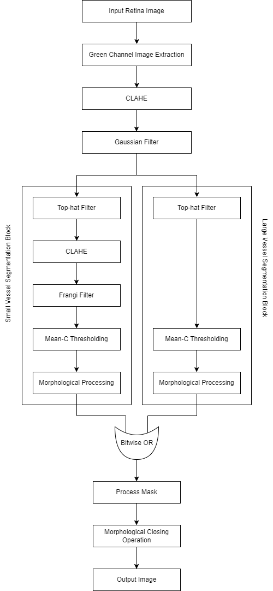

# Retina-Blood-Vessel-Segmentation
- implemented retina blood vessel segmentation using both filter-based method and machine learning based method.
- Flow diagram of the proposed filter-based method:  

  

