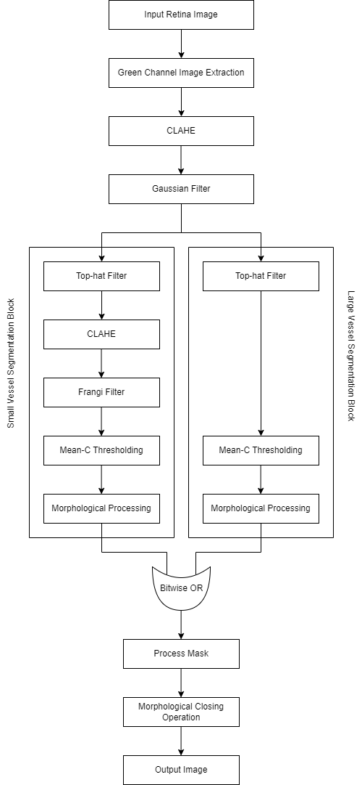

# Retina-Blood-Vessel-Segmentation
- Implemented retina blood vessel segmentation using both 1) filter-based method and 2) machine learning based method (U-Net).
- Flow diagram of the proposed filter-based method:  

  

